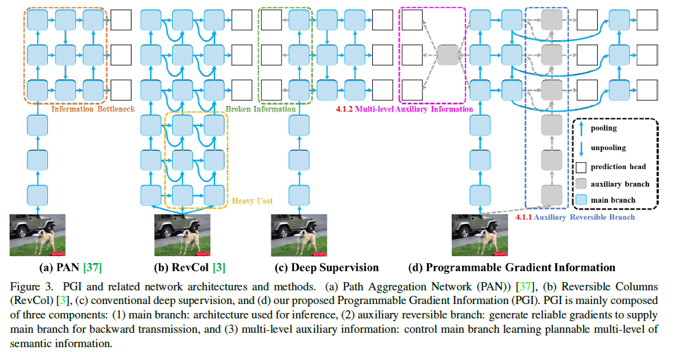
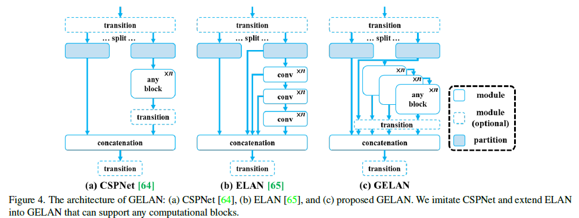
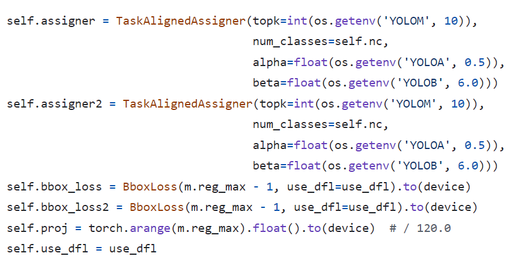
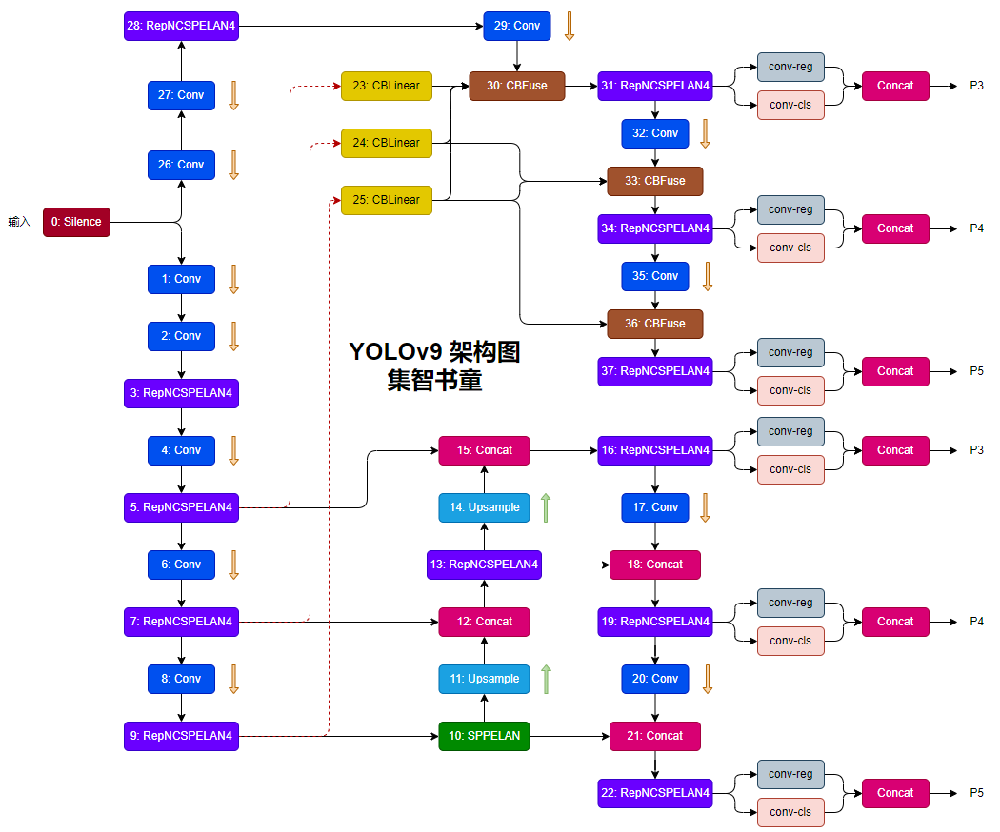
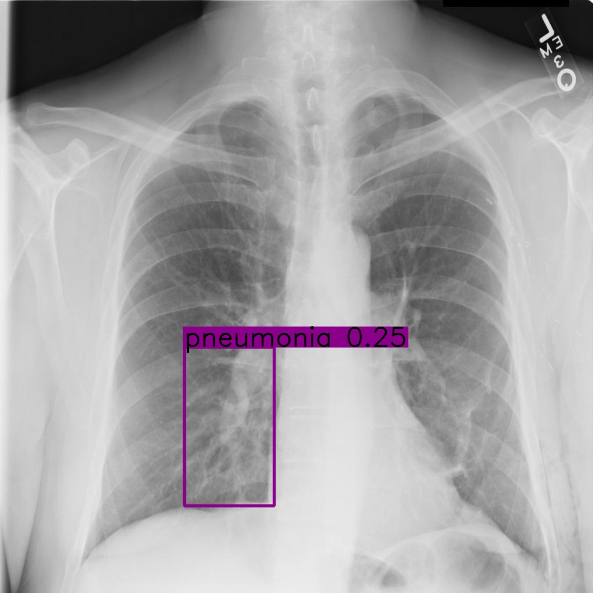
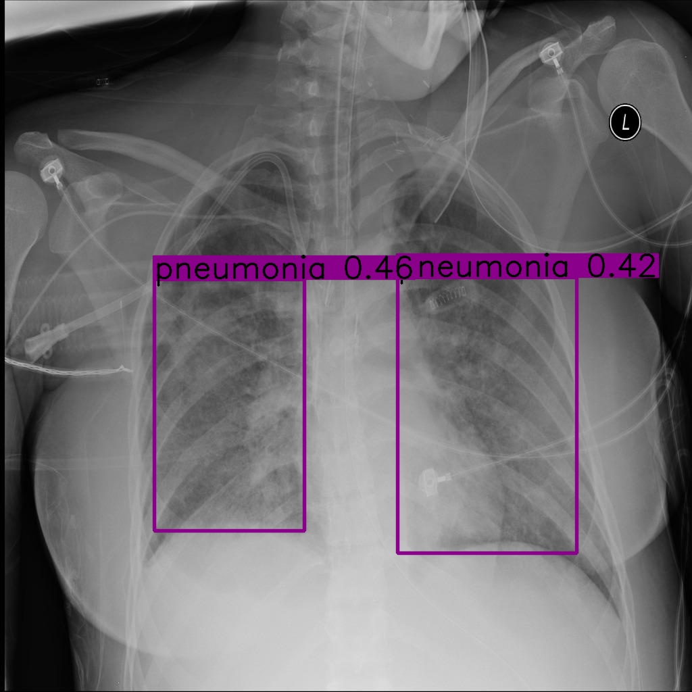

## Official YOLOv9 训练自己的数据集并基于NVIDIA TensorRT和及安卓手机端部署

### 1.YOLOv9算法解读

!> YOLOv9的改进

+ YOLOv9从可逆函数角度理论上分析了现有的CNN架构，基于这种分析，YOLOv9作者还设计了PGI和辅助可逆分支，并取得了优秀的结果；
+ YOLOv9用到的PGI解决了深度监督只能用于极深的神经网络架构的问题，因此使得新的轻量级架构才更适合落地；
+ YOLOv9中设计的GELAN仅使用传统卷积，就能实现比基于最先进技术的深度可分卷积设计更高的参数使用率，同时展现出轻量级、快速和精确的巨大优势；
+ 基于所提出的PGI和GELAN，YOLOv9在MS COCO数据集上的性能在所有方面都大大超过了现有的实时目标检测器。


!> PGI(可编程梯度信息)

PGI主要包括三个组成部分，即：

+ 主分支
+ 辅助可逆分支
+ 多级辅助信息



!> GELAN模块

YOLOv9提出了新网络架构——GELAN。GELAN通过结合两种神经网络架构，即结合用梯度路径规划（CSPNet）和（ELAN）设计了一种广义的高效层聚合网络（GELAN）；GELAN综合考虑了轻量级、推理速度和准确度。



GELAN整体架构如上图所示。YOLOv9将ELAN的能力进行了泛化，原始ELAN仅使用卷积层的堆叠，而GELAN可以使用任何计算块作为基础Module。

!> 损失函数与样本匹配



通过上图代码可以看到:
+ 样本匹配依旧使用的是TaskAlign样本匹配。和YOLOv8、YOLOE、YOLOv6等算法保持一致；
+ 分类损失：BCE Loss 回归损失：DFL Loss + CIoU Loss

!> 模型结构




### 2.构建自己的训练数据集训练YOLOv9

假设我们有NVIDIA的计算卡，同时配置好了YOLOv9运行需要的环境！

+ 训练数据的构建

YOLOv9遵循YOLOv5-YOLOv8的训练数据构建方式，可以参考：<https://github.com/DataXujing/YOLO-v5>, 这里以肺炎X-ray数据集作为训练YOLOv9-c模型的数据集。

+ 构建数据集配置文件:`./data/xray.yaml`

```yaml
path: ./datasets/xray  # dataset root dir
train: images/train/   # train images (relative to 'path') 118287 images
val: images/val/  # val images (relative to 'path') 5000 images
test: images/test/   # 20288 of 40670 images, submit to https://competitions.codalab.org/competitions/20794

# Classes
names:
  0: pneumonia

```

+ 构建YOLOv9-c模型配置文件：`models/detect/yolov9-c.yaml`

```yaml
# YOLOv9

# parameters
nc: 1  # number of classes
depth_multiple: 1.0  # model depth multiple
width_multiple: 1.0  # layer channel multiple
#activation: nn.LeakyReLU(0.1)
#activation: nn.ReLU()

# anchors
anchors: 3

......
```

+ 下载预训练的模型：

```shell
wget https://github.com/WongKinYiu/yolov9/releases/download/v0.1/yolov9-c.pt
```

+ 训练YOLOv9-c

```shell
python3 train_dual.py  --weights=./pretrain/yolov9-c.pt --cfg=./models/detect/yolov9-c.yaml --data=./data/xray.yaml --epoch=100 --batch-size=16 --imgsz=640 --hyp=data/hyps/hyp.scratch-high.yaml
```

### 3.YOLOv9推理Demo

```python
python inference.py
```

|  |  |  |
| ------ | ------ | ------ |
|  |   |   |


### 4.YOLOv9 端到端TensorRT加速推理C++实现

TODO


### 5.YOLOv9安卓手机部署

TODO


### 参考

1. [YOLOv9开源 | 架构图&模块改进&正负样本匹配&损失函数解读，5分钟即可理解YOLOv9](https://mp.weixin.qq.com/s/31NlBknx4PcXipfuV2w6hw)

2. [YOLOv9: Learning What You Want to Learn Using Programmable Gradient Information](https://arxiv.org/abs/2402.13616)

3. https://github.com/WongKinYiu/yolov9


